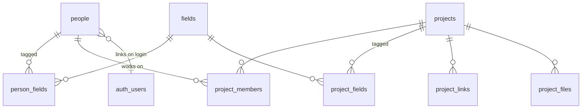

# ideaLab Website

The portfolio site for **HisarCS ideaLab** — makers across all disciplines,
their profiles, and their projects. This is the only document you need: read it
top to bottom and you can run the site locally and deploy it to production
without having seen the code before.

- **What:** a static website (plain HTML/CSS/JS) backed by Supabase (Postgres,
  Auth, Storage).
- **Why static + Supabase:** the frontend is free to host and has no server to
  maintain; every rule that matters (who can read/write what) lives in the
  database as Row Level Security, so a buggy or malicious frontend still can't
  leak or corrupt data. A future React/mobile client inherits the same rules.
- **Where it runs:** GitHub Pages for the pages, a Supabase cloud project for
  the backend. Locally, the whole Supabase stack runs in Docker.
- **How the two connect:** every page loads [`config.js`](config.js), which
  picks the local or production backend automatically by hostname.

```
Browser (GitHub Pages, static)                Supabase (cloud or local Docker)
  index.html   homepage pixel mark  ──┐        ┌── Postgres + Row Level Security
  person.html  public profile        ─┤ supa-  │   Auth — "Sign in with GitHub"
  member.html  sign-in + dashboard   ─┤ base  ─┤   Storage (avatars, project-files)
  project.html project view/editor   ─┘  js    └── admin_github_logins allowlist
```

---

## 1. Repo layout — where everything lives

| Path | Role |
|---|---|
| `index.html` | Homepage: the pixel-art `.)` mark, one pixel per published person. |
| `person.html` | Public profile page — loads a person by `?id=` (their `public_id`) from Supabase; falls back to an id-derived preview if the backend is unreachable. |
| `member.html` | Signed-in area: GitHub sign-in → org check → onboarding → dashboard (edit profile, tags, projects, delete account). |
| `project.html` | Project page — loads a project by `?id=` (its `public_id`) from Supabase (members, tags, description, files, links). Editor-mode mutations are still prototype stubs (see §9). |
| `config.js` | Picks local vs production Supabase by hostname; falls back to mock data if the backend is unreachable. |
| `vendor/supabase.js` | Vendored supabase-js v2 (UMD build), served same-origin from Pages — no third-party CDN dependency, so the site works on networks that filter CDNs. To update: re-download the UMD build from npm/jsdelivr into this file. |
| `serve.json` | Config for the local dev server (`npm run dev`) so it serves `.html` paths with query strings intact, like GitHub Pages. |
| `supabase/` | **Backend + local dev.** `migrations/20260711000001_schema.sql` is the whole database (tables, RLS, triggers, the directory view, storage buckets, starter tags — the single source of truth); `seed.sql` is local-only mock data replayed on each local reset (**never** touches production); `config.toml` holds local CLI settings. |
| `tests/` | **Testing.** `playwright.config.js` + `e2e.spec.js` — end-to-end tests (DB-backed rendering, the RLS contract, graceful fallback). Run with `npm test`. |
| `package.json` | npm scripts (`dev`, `stack`, `test`, `db:push`) + dev dependencies. |
| `README.md` | This document. |

App pages, `config.js`, and `serve.json` stay at the repo root because GitHub
Pages serves the site from there; everything for **testing** lives in `tests/`
and everything for the **backend / local dev** lives in `supabase/`.

The database is deliberately **one migration file**. Nothing has shipped yet, so
there is no history to preserve — the file describes the final schema directly,
with inline comments explaining every table and column. When you change the
schema, add a *new* timestamped migration; never edit tables by hand in a way
that drifts local from production.

---

## 2. Data model — what's stored and why

Full field-level detail (with comments) is in the migration; this is the map.



- **`people`** — one row per maker. Three identifiers, each with a distinct job:
  `id` (uuid primary key — the row's internal identity, what foreign keys point
  to), `public_id` (the name-derived URL key like `person.html?id=mert-karakas`,
  auto-generated from `full_name` on insert), and `user_id` (nullable link to the
  Supabase Auth / GitHub login — null until the person first signs in). Plus
  profile fields (bio, avatar, resume, etc.) and `is_published`.
  - *Why a nullable `graduation_year`:* a row is created the moment someone
    signs in (before they fill anything in), but a database `CHECK` makes it
    impossible to **publish** without a year.
  - *Why `student`/`alumni` isn't stored:* it's derived from `graduation_year`
    against the academic year (flips July 1, Istanbul) by the
    `current_academic_year()` function. Nobody updates flags every June.
  - *`github_username` is server-owned.* A trigger forces it to the GitHub login
    from the auth token whenever the row is linked — members can't spoof it (see §3).
- **`fields`** — one canonical tag list shared by people **and** projects, so
  "Robotics" is spelled one way everywhere. Uniqueness is case-insensitive.
  Members can add tags; only admins rename/merge/delete them.
- **`projects`** — member-owned. `created_by` records the maker; a trigger
  auto-adds them to `project_members`. Rich content lives in `project_files`
  (media, in the storage bucket) and `project_links` (external URLs).
- **Junction tables** (`person_fields`, `project_fields`, `project_members`)
  are the many-to-many links. `project_members` doubles as the permission list:
  *being on it is the right to edit the project.*
- **`admin_github_logins`** — the allowlist of admin GitHub usernames.
- **`people_directory`** (a view) — the one thing the public pages read:
  published people + derived cohort + their tag names, in a single query.

**Reading strategy:** at lab scale (hundreds of people, a few KB) the site
fetches `people_directory` once and searches/sorts/filters in JavaScript —
instant, no per-keystroke network calls. So `people` is intentionally lightly
indexed; the migration lists the sort/search indexes to add back if the dataset
ever grows large.

---

## 3. Roles & security — who can do what

Every rule below is enforced by the **database** (RLS policies + triggers), not
the frontend.

| Actor | Can |
|---|---|
| **Anon** (public visitor) | Read published people & projects. |
| **Member** (signed in, has a profile) | Read + edit **their own** row (except the login link, publish flag, and GitHub username); manage their own tags; create tags; create/edit/delete projects they're a member of; delete their own account. |
| **Admin** (on the allowlist) | Everything, including publishing profiles and managing admins. |
| **Service role** (SQL editor, seed scripts) | Bypasses RLS entirely — used for setup and hand-edits. |

- **Members can't publish themselves.** New profiles are drafts; an **admin**
  publishes them (a `guard_people_update` trigger blocks members from flipping
  `is_published` or `user_id`). This is the curation gate.
- **Projects publish themselves.** Any member on a project's member list can
  edit, publish, or delete it, and add/remove members. When the last member
  leaves, a trigger deletes the orphaned project.
- **Admins are unspoofable.** `is_admin()` reads your GitHub username from the
  **auth token** (which you cannot edit), not from any editable profile field,
  and checks it against `admin_github_logins`. `kmert10` is the seeded founding
  admin. Add more with one SQL insert (see §8) — no redeploy.
- **`github_username` can't be spoofed either.** It's a display value, but a
  trigger overwrites it with the real GitHub login from the auth token on every
  linked insert/update, so nobody can point their profile's GitHub link at
  someone else's handle.

---

## 4. Auth & signup flow

The auth provider is a **GitHub App** ("Sign in with GitHub") — see §7B to set
it up. The flow:

1. Visitor clicks "Continue with GitHub" → GitHub authorization → back to
   `member.html` signed in.
2. The app checks **HisarCS org membership** using the signed-in user's token
   (`GET /user/memberships/orgs/HisarCS`). This works because the GitHub App has
   the "Organization → Members: read" permission and is installed on the org.
   - **Member →** continues to onboarding.
   - **Not a member →** shown a "not one of us — email us" page **and signed
     out immediately** (a non-member is never left with a live session; no
     sign-out button, no dashboard access).
3. First-time members get an onboarding form (name, graduation year, interests)
   which inserts their `people` row as a **draft** with a server-generated `public_id`.
4. The dashboard shows a draft banner until an admin publishes them — at which
   point their pixel appears on the homepage.

> The org check is a **UX filter, not the security boundary.** The real gate is
> that admins publish profiles, so an unverified draft never shows publicly. If
> you want membership enforced server-side too, add the Edge Function in §9.

Account deletion is one call, `delete_my_account()` (behind a typed-name
confirmation modal): it erases the person, their tags, their memberships (solo
projects cascade away), and the GitHub login itself.

---

## 5. Storage & file uploads

Three public-read Supabase Storage buckets, with writes scoped by folder
ownership (RLS on `storage.objects`):

- `avatars/{user_id}/…` — the member's avatar, stored twice: a 512px master
  (`avatar-512.jpg`) and a 128px thumb (`avatar-128.jpg`) for the homepage
  grid. When `avatar_url` is empty the UI renders an initials tile tinted by
  `avatar_color`.
- `resumes/{user_id}/…` — the member's resume PDF (`resume.pdf`; a new upload
  replaces the old one). Members can alternatively paste an external link.
- `project-files/{project_id}/…` — writable by that project's member list;
  metadata (caption, kind, order) lives in the `project_files` table.

**Upload requirements** — defined once in `IDEALAB_UPLOADS` (config.js) and
enforced in every upload UI:

| File | Accepted types | Max source size | What's stored |
|---|---|---|---|
| Avatar | JPEG, PNG, WebP | 10 MB | auto-cropped square, optimized 512px JPEG + 128px thumb (~100 KB + ~15 KB) |
| Resume | PDF | 5 MB | the PDF as-is (recompression would cost fidelity) |
| Project image | JPEG, PNG, WebP | 15 MB | optimized 1600px JPEG (~300–500 KB) |
| Project PDF | PDF | 10 MB | the PDF as-is |

**Why it stays fast without losing quality:** images are optimized
*client-side* before upload (`idealabOptimizeImage` — stepped high-quality
downscale, JPEG q0.85: visually lossless at the sizes the site displays, but
10–20× smaller than a phone photo). The homepage grid loads the 128px thumbs
(~2 MB cold for 120 people instead of ~18 MB) with lazy loading; profile and
project pages show the full-quality versions. Files upload under unique or
version-busted paths with 1-year CDN cache headers. Full-account erasure also
deletes the member's storage folders, and deleting a project clears its files.

---

## 6. Run it locally

No build step for the frontend — "building" means serving the folder. The
backend runs as real Supabase in Docker.

**One-time setup:**

```bash
# Tools (macOS shown; Windows: winget/scoop equivalents)
brew install git node
brew install supabase/tap/supabase
brew install --cask docker && open -a Docker      # wait for "running"

npm install                                        # dev deps (serve, supabase, playwright)
npx playwright install chromium                    # only if you'll run tests

# A localhost-only docker network so the local DB is never exposed to your LAN
docker network create -o 'com.docker.network.bridge.host_binding_ipv4=127.0.0.1' local-network
```

**Frontend only** (mock data, fastest):

```bash
npm run dev        # http://localhost:3000, no database needed
```

**Full stack** (real DB, auth, storage):

```bash
npm run stack      # starts Supabase on the localhost-only network + applies the migration + seed
npm run dev        # in a second terminal — the pages now talk to your local DB
```

`config.js` already points at the local stack with the CLI's demo anon key. If
`npx supabase status` prints a different key, paste it into the `local` block.
Studio (the DB admin UI) is at http://127.0.0.1:54323.

**Daily commands:**

| Command | Does |
|---|---|
| `npm run dev` | Serve the frontend at :3000 (reads `serve.json`). |
| `npm run stack` | Start the local Supabase stack (localhost-only). |
| `npm run stack:down` | Stop it, discarding data. |
| `npm run stack:reset` | Stop + start = a clean DB rebuilt from the migration + seed. |
| `npm test` | Run the Playwright e2e suite (live tests self-skip if the stack is down). |
| `npx supabase status` | Re-print local URLs and keys. |

> ⚠️ **Don't run `supabase db reset` on the `local-network`.** It recreates the
> DB container on the wrong network and the other containers can't reach it
> (`storage container is not ready: unhealthy`). Use `npm run stack:reset`
> instead — it cycles the stack, which replays migrations + seed cleanly.

GitHub sign-in is optional locally: the public pages need no auth, and you can
create test people directly in Studio. To test the real login flow locally,
make a **separate dev GitHub App** whose callback points at the local Supabase
(`http://127.0.0.1:54321/auth/v1/callback`) and set its Client ID/secret in
`supabase/config.toml` — never reuse the production app's secret locally.

---

## 7. Deploy to production

### A. Supabase project (one-time)

1. Create a project at supabase.com (free tier, nearby region). Save the DB
   password.
2. Apply the schema: `npx supabase link --project-ref <ref>` once, then
   `npm run db:push`. (Or paste the migration into the dashboard SQL editor.)
   `seed.sql` is local-only and never pushed — production data is real.

### B. GitHub App for "Sign in with GitHub" (the site's own auth app)

This site needs its **own** auth app. The **Supabase↔GitHub integration** app
in your org (used for repo/branching/deploys) is a different thing and **cannot**
be reused for user login. Create a dedicated GitHub App, owned by the org so it
survives graduations:

1. github.com → **HisarCS org → Settings → Developer settings → GitHub Apps →
   New GitHub App**:
   - **Name:** e.g. `ideaLab Login`.
   - **Homepage URL:** `https://hisarcs.github.io/HisarCS-mastersite/`
   - **Callback URL:** `https://<project-ref>.supabase.co/auth/v1/callback`
   - Check **"Request user authorization (OAuth) during installation."**
   - **Webhook:** uncheck **Active** (not needed).
   - **Permissions:**
     - *Account* → **Email addresses: Read-only** (so Supabase can read the email).
     - *Organization* → **Members: Read-only** (for the HisarCS membership check).
   - **Where can this app be installed:** *Only on this account* (HisarCS).
   - Create the app, then **generate a client secret** and copy the **Client ID**.
2. **Install the app on the HisarCS org** (the app's page → *Install App* →
   HisarCS → *All members*). Without installation the membership check can't
   read org data.
3. Supabase → *Authentication → Providers → GitHub* → enable → paste the
   **Client ID** and **Client secret**.
4. Supabase → *Authentication → URL Configuration* → **Site URL** = the Pages
   URL above; add `http://localhost:3000` as an additional **Redirect URL** for
   local dev.
5. Fill the `production` block in [`config.js`](config.js) with the project's
   URL + anon key (*Settings → API*; the anon key is public-safe — RLS is the
   real boundary).

> **Membership-check note.** The gate calls `GET /user/memberships/orgs/HisarCS`
> with the signed-in user's token; it resolves once the GitHub App has
> *Members: read* **and** is installed on the org. If GitHub ever stops serving
> that endpoint for user-to-server tokens, the robust upgrade is the Edge
> Function in §9 (checks membership with an app *installation* token). Either
> way, admins publishing profiles is the actual security gate.

### C. GitHub Pages

1. Push to `HisarCS/HisarCS-mastersite` (`main`). `.nojekyll` is committed so
   Pages serves files verbatim.
2. Repo → *Settings → Pages* → *Deploy from a branch* → `main` / `/ (root)`.
   Every subsequent `git push` redeploys automatically. Site:
   `https://hisarcs.github.io/HisarCS-mastersite/`.
3. Project Pages live under `/HisarCS-mastersite/`; keep links relative and use
   `?id=` query routing for per-person/per-project URLs (the code already does).

### D. First admin & smoke test

`kmert10` is seeded as admin. Then verify, in production:

- [ ] Homepage loads real published people; clicking a pixel opens the right profile.
- [ ] `kmert10` signs in → `is_admin()` returns true (Studio SQL).
- [ ] A **member** account: sign in → onboarding → draft → admin publishes → pixel appears.
- [ ] A **non-member** account: sign in → "not one of us" page, and it's signed out (no dashboard).
- [ ] A project opens by id with its real members, tags, and links.

---

## 8. Admin operations (hand-editing)

Use Studio (Table Editor / SQL Editor) — local at http://127.0.0.1:54323,
production at supabase.com/dashboard → your project. **Studio runs as the
service role: it bypasses RLS and guard triggers**, so you can edit anything;
data-generating triggers (public_ids, field creators, github sync) still fire.

```sql
-- publish a member (required: graduation_year is set)
update people set is_published = true where public_id = 'mert-karakas';

-- add / remove an admin
insert into admin_github_logins (github_login) values ('their-username');
delete from admin_github_logins where github_login = 'their-username';

-- rename a tag (updates chips everywhere) / delete a tag (detaches it)
update fields set name = 'CS & AI' where name = 'CS and AI';
delete from fields where name = 'Typo Tag';

-- publish a project
update projects set is_published = true where public_id = 'pixel-wall';

-- see exactly what the public site sees
select * from people_directory;
```

Golden rules: local mistakes are free (`npm run stack:reset`); production has no
reset, so prefer the site's own flows and hand-edit surgically; **schema changes
always go through a new migration file**, never Studio, so local and prod stay
identical.

---

## 9. Next — roadmap

Public/read views (homepage, profiles, project pages) are wired to Supabase.
Still to build:

1. **Finish the project editor.** File upload/delete is fully wired (editor
   rights checked via `is_project_editor`); the remaining mutations — title,
   description, publish toggle, members, tags, links — are still prototype
   stubs, each annotated inline with its real Supabase call. `member.html`'s
   dashboard is already wired.
2. Build the **People** and **Projects** directory pages (search / sort /
   filter — the `people_directory` view already backs this).
3. Build a small **admin panel** (publish queue for new members, manage the
   allowlist, edit anyone).
4. **Harden the org gate server-side.** A Supabase Edge Function that verifies
   HisarCS membership with a GitHub App *installation* token (instead of the
   client-side user-token check) makes the gate unspoofable and immune to
   GitHub's user-to-server endpoint rules.
5. Extensions the schema already anticipates: cohort override for mentors/staff,
   an awards table, full-text bio search.
