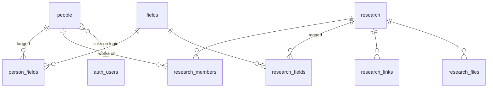

# ideaLab Website

The portfolio site for **HisarCS ideaLab** — makers across all disciplines,
their profiles, and their research. This is the only document you need: read it
top to bottom and you can run the site locally and deploy it to production
without having seen the code before.

- **What:** a Next.js 15 app (App Router) built as a **static export**, backed by
  Supabase (Postgres, Auth, Storage).
- **Why static + Supabase:** the frontend is free to host and has no server to
  maintain; every rule that matters (who can read/write what) lives in the
  database as Row Level Security, so a buggy or malicious frontend still can't
  leak or corrupt data. A future mobile client inherits the same rules.
- **Where it runs:** GitHub Pages for the pages, a Supabase cloud project for
  the backend. Locally, the whole Supabase stack runs in Docker.
- **How the two connect:** [`lib/env.ts`](lib/env.ts) picks the local or
  production backend automatically by hostname, at runtime.

```
Browser (GitHub Pages, static export)         Supabase (cloud or local Docker)
  /            homepage pixel mark  ──┐        ┌── Postgres + Row Level Security
  /members     member directory      ─┤        │   Auth — "Sign in with GitHub"
  /research    research directory    ─┤ supa- ─┤   Storage (avatars, resumes,
  /person?id=  public profile        ─┤ base   │            research-files)
  /research?id= research entry       ─┤  js    └── admin_github_logins allowlist
  /member      sign-in + dashboard   ─┘
```

---

## 1. Repo layout — where everything lives

The site is a **Next.js 15 app (App Router) built as a static export** to
GitHub Pages. There is no server at runtime — `npm run build` emits `out/`.

| Path           | Role                                                                                                                                                                                                                                                                                                                         |
| -------------- | ---------------------------------------------------------------------------------------------------------------------------------------------------------------------------------------------------------------------------------------------------------------------------------------------------------------------------- |
| `app/`         | Routes. `/` (the pixel-art `.)` mark), `/members` + `/research` (card-grid directories), `/person?id=`, `/research?id=`, `/member` (signed-in area). `/project?id=` is a deprecated redirect to `/research?id=`.                                                                                                             |
| `components/`  | React components + CSS Modules. Views: `PersonView`, `ResearchView` (curated write-ups), `ResearchEntryView` (member-created, DB-backed), `MembersIndex`, `ResearchIndex`, `PixelMark`, `MemberArea` (+ `member/` sub-components), and the shared `SiteHeader`.                                                              |
| `lib/`         | Framework-agnostic layers. `env.ts` (local vs production Supabase by hostname), `supabase.ts` (browser client), `data/` (queries: `members`, `researchEntries`, `research` (curated), `profile`, `auth`, `storage`, `mock`), `domain/` (types + pure logic), `util/`, `homepage/mark.ts`.                                    |
| `public/`      | Static assets served as-is, including the preserved research write-ups (`research/<slug>.html`) and their card thumbnails (`research/thumb/`).                                                                                                                                                                               |
| `supabase/`    | **Backend + local dev.** `migrations/` is the database (append-only; `20260711000001_schema.sql` is the baseline), `functions/` holds the Deno edge functions (`verify-org-member`), `seed.sql` is local-only mock data replayed on each local reset (**never** touches production), `config.toml` holds local CLI settings. |
| `tests/unit/`  | **Testing.** vitest unit suite over the pure logic in `lib/`. Run with `npm test`.                                                                                                                                                                                                                                           |
| `docs/`        | Architecture decisions, local development + debugging guides, migration notes.                                                                                                                                                                                                                                               |
| `package.json` | npm scripts (`dev`, `build`, `check`, `stack`, `logs:edge`, `db:push`) + dependencies.                                                                                                                                                                                                                                       |
| `README.md`    | This document.                                                                                                                                                                                                                                                                                                               |

Mock data exists **only on localhost** (dev playground); production never fakes
content — an empty lab renders the mark in ink only, and missing profiles or
research show an honest "unavailable" card.

The schema began as **one editable migration** (readable end state, no
build-then-undo history). That era ended when production gained real member data:
migrations are now **append-only**. `20260711000001_schema.sql` is the baseline,
and future changes ship as their own timestamped files (see ADR-0003). Never edit
tables by hand in Studio, or local and production drift.

> Editing an already-applied migration in place is a **no-op on production** —
> `supabase db push` skips migrations it has already recorded. If a deployed
> project is missing something you "added" to the baseline, ship a new migration.

---

## 2. Data model — what's stored and why

Full field-level detail (with comments) is in the migration; this is the map.


```mermaid
erDiagram
    people ||--o{ person_fields : tagged
    fields ||--o{ person_fields : ""
    people ||--o{ research_members : "works on"
    research ||--o{ research_members : ""
    research ||--o{ research_fields : tagged
    fields ||--o{ research_fields : ""
    research ||--o{ research_links : ""
    research ||--o{ research_files : ""
    people }o--|| auth_users : "links on login"
```

- **`people`** — one row per maker. Three identifiers, each with a distinct job:
  `id` (uuid primary key — the row's internal identity, what foreign keys point
  to), `public_id` (the name-derived URL key like `/person?id=mert-karakas`,
  auto-generated from `full_name` on insert), and `user_id` (nullable link to the
  Supabase Auth / GitHub login — null until the person first signs in). Plus
  profile fields (bio, avatar, resume, etc.) and `is_published`.
  - _Why a nullable `graduation_year`:_ a row is created the moment someone
    signs in (before they fill anything in), but a database `CHECK` makes it
    impossible to **publish** without a year.
  - _Why `student`/`alumni` isn't stored:_ it's derived from `graduation_year`
    against the academic year (flips July 1, Istanbul) by the
    `current_academic_year()` function. Nobody updates flags every June.
  - _`github_username` is server-owned._ A trigger forces it to the GitHub login
    from the auth token whenever the row is linked — members can't spoof it (see §3).
- **`fields`** — one canonical tag list shared by people **and** research, so
  "Robotics" is spelled one way everywhere. Uniqueness is case-insensitive.
  Members can add tags; only admins rename/merge/delete them.
- **`research`** — member-owned research entries. `created_by` records the
  maker; a trigger auto-adds them to `research_members`. Rich content lives in
  `research_files` (media, in the storage bucket) and `research_links` (external
  URLs). _These tables were named `projects*` until the concepts merged — see
  ADR-0018._
  - _Curated research is **not** in the database._ The eight editorial
    write-ups are static content (`lib/data/research.ts` + preserved HTML in
    `public/research/`), so `/research` shows curated entries and published DB
    entries together, curated first.
- **Junction tables** (`person_fields`, `research_fields`, `research_members`)
  are the many-to-many links. `research_members` doubles as the permission list:
  _being on it is the right to edit that research entry._
- **`admin_github_logins`** — the allowlist of admin GitHub usernames.
- **`people_directory`** (a view) — the one thing the public pages read:
  published people + derived cohort + their tag names, in a single query.

**Reading strategy:** at lab scale (hundreds of people, a few KB) the site
fetches `people_directory` once and searches/sorts/filters in JavaScript —
instant, no per-keystroke network calls. So `people` is intentionally lightly
indexed; the migration lists the sort/search indexes to add back if the dataset
ever grows large.

---

## 3. Roles & security — who can do what

Every rule below is enforced by the **database** (RLS policies + triggers), not
the frontend.

| Actor                                       | Can                                                                                                                                                                                                      |
| ------------------------------------------- | -------------------------------------------------------------------------------------------------------------------------------------------------------------------------------------------------------- |
| **Anon** (public visitor)                   | Read published people & research.                                                                                                                                                                        |
| **Member** (signed in, has a profile)       | Read + edit **their own** row (except the login link, publish flag, and GitHub username); manage their own tags; create tags; create/edit/delete research they're a member of; delete their own account. |
| **Admin** (on the allowlist)                | Everything, including publishing profiles and managing admins.                                                                                                                                           |
| **Service role** (SQL editor, seed scripts) | Bypasses RLS entirely — used for setup and hand-edits.                                                                                                                                                   |

- **Members publish themselves.** New profiles start as drafts, and the member
  publishes (or unpublishes) their own from the dashboard. The
  `guard_people_update` trigger still blocks changes to `user_id` (the login
  link), and the `people_published_needs_year` CHECK refuses to publish a
  profile with no graduation year. See ADR-0016. Publishing (and every other
  write) is gated on **verified HisarCS org membership**, enforced in the
  database via `is_org_member()` — see the org-gate bullet below and ADR-0017.
- **Research publishes itself.** Any member on a research entry's member list
  can edit, publish, or delete it, and add/remove members. When the last member
  leaves, a trigger deletes the orphaned entry.
- **Org membership is server-enforced.** Every write requires
  `is_org_member()` — creating or editing a profile (even a draft), tags,
  research, and uploads. It reads your GitHub login from the **auth token** and
  checks the `org_members` roster, which the `verify-org-member` Edge Function
  keeps current (lazily, on each visit — no cron). A non-member has read-only
  access and can create nothing. See ADR-0017 and §9.
- **Admins are unspoofable.** `is_admin()` reads your GitHub username from the
  **auth token** (which you cannot edit), not from any editable profile field,
  and checks it against `admin_github_logins`. `kmert10` is the seeded founding
  admin. Add more with one SQL insert (see §8) — no redeploy.
- **`github_username` can't be spoofed either.** It's a display value, but a
  trigger overwrites it with the real GitHub login from the auth token on every
  linked insert/update, so nobody can point their profile's GitHub link at
  someone else's handle.

---

## 4. Auth & signup flow

The auth provider is a **GitHub App** ("Sign in with GitHub") — see §7B to set
it up. The flow:

1. Visitor clicks "Continue with GitHub" → GitHub authorization → back to
   `/member` signed in.
2. The app checks **HisarCS org membership** by invoking the `verify-org-member`
   Edge Function, which asks GitHub with the app's own _installation_ token and
   writes the `org_members` roster that RLS enforces (see ADR-0017, §9).
   - **Member →** continues to onboarding.
   - **Not a member →** shown a "not one of us — email us" page **and signed
     out immediately** (a non-member is never left with a live session; no
     sign-out button, no dashboard access).
3. First-time members get an onboarding form (name, graduation year, interests)
   which inserts their `people` row as a **draft** with a server-generated `public_id`.
4. The dashboard shows a draft banner with a **Publish my profile** button — the
   member publishes themselves, and their pixel appears on the homepage. They can
   unpublish at any time.

> ✅ Members self-publish (ADR-0016), but org membership is now **enforced
> server-side** (ADR-0017): every write is gated on `is_org_member()`, and the
> `verify-org-member` Edge Function verifies against GitHub with an app
> installation token. The browser check is advisory UX; RLS is the boundary. A
> non-member calling the API directly with the anon key can create nothing.

Account deletion is one call, `delete_my_account()` (behind a typed-name
confirmation modal): it erases the person, their tags, their memberships (solo
research entries cascade away), and the GitHub login itself.

---

## 5. Storage & file uploads

Three public-read Supabase Storage buckets, with writes scoped by folder
ownership (RLS on `storage.objects`):

- `avatars/{user_id}/…` — the member's avatar, stored twice: a 512px master
  (`avatar-512.jpg`) and a 128px thumb (`avatar-128.jpg`) for the homepage
  grid. When `avatar_url` is empty the UI renders an initials tile tinted by
  `avatar_color`.
- `resumes/{user_id}/…` — the member's resume PDF (`resume.pdf`; a new upload
  replaces the old one). Members can alternatively paste an external link.
- `research-files/{research_id}/…` — writable by that entry's member list;
  metadata (caption, kind, order) lives in the `research_files` table. (Renamed
  from `project-files` — see ADR-0018.)

**Upload requirements** — defined once in `UPLOAD_SPECS` (`lib/util/media.ts`)
and enforced in every upload UI:

| File           | Accepted types  | Max source size | What's stored                                                              |
| -------------- | --------------- | --------------- | -------------------------------------------------------------------------- |
| Avatar         | JPEG, PNG, WebP | 10 MB           | auto-cropped square, optimized 512px JPEG + 128px thumb (~100 KB + ~15 KB) |
| Resume         | PDF             | 5 MB            | the PDF as-is (recompression would cost fidelity)                          |
| Research image | JPEG, PNG, WebP | 15 MB           | optimized 1600px JPEG (~300–500 KB)                                        |
| Research PDF   | PDF             | 10 MB           | the PDF as-is                                                              |

**Why it stays fast without losing quality:** images are optimized
_client-side_ before upload (`optimizeImage` in `lib/util/media.ts` — stepped
high-quality downscale, JPEG q0.85: visually lossless at the sizes the site
displays, but 10–20× smaller than a phone photo). The homepage grid loads the
128px thumbs (~2 MB cold for 120 people instead of ~18 MB) with lazy loading;
profile and research pages show the full-quality versions. Files upload under
unique or version-busted paths with 1-year CDN cache headers. Full-account
erasure also deletes the member's storage folders (client-side via the Storage
API, then the RPC — see ADR-0015).

---

## 6. Run it locally

The frontend is a Next.js app (`npm run build` → static `out/`); in development
`npm run dev` runs the Next dev server. The backend runs as real Supabase in
Docker. For the full guide — including the member/auth area, which needs a
GitHub App — see [docs/local-development.md](docs/local-development.md), and
[docs/local-debugging.md](docs/local-debugging.md) when something misbehaves.

**One-time setup:**

```bash
# Tools (macOS shown; Windows: winget/scoop equivalents)
brew install git node
brew install supabase/tap/supabase
brew install --cask docker && open -a Docker      # wait for "running"

npm install                                        # deps (Next, supabase CLI, vitest)

# A localhost-only docker network so the local DB is never exposed to your LAN
docker network create -o 'com.docker.network.bridge.host_binding_ipv4=127.0.0.1' local-network
```

**Frontend only** (mock data, fastest):

```bash
npm run dev        # http://localhost:3000, no database needed
```

Mock data renders only on localhost, so the pages are populated without a DB.

**Full stack** (real DB, auth, storage):

```bash
npm run stack      # starts Supabase on the localhost-only network + applies the migration + seed
npm run dev        # in a second terminal — the pages now talk to your local DB
```

`lib/env.ts` already points at the local stack with the CLI's demo anon key, and
switches to production automatically by hostname. If `npx supabase status` prints
a different key, paste it into the `local` block.
Studio (the DB admin UI) is at http://127.0.0.1:54323.

**Daily commands:**

| Command               | Does                                                         |
| --------------------- | ------------------------------------------------------------ |
| `npm run dev`         | Next dev server at :3000.                                    |
| `npm run build`       | Static export to `out/` (set `NEXT_PUBLIC_BASE_PATH` first). |
| `npm run stack`       | Start the local Supabase stack (localhost-only).             |
| `npm run stack:down`  | Stop it, discarding data.                                    |
| `npm run stack:reset` | Stop + start = a clean DB rebuilt from the migration + seed. |
| `npm run check`       | Format check + lint + typecheck + unit tests.                |
| `npm test`            | Run the vitest unit suite.                                   |
| `npm run logs:edge`   | Tail the local edge-function logs.                           |
| `npm run db:psql`     | psql shell on the local database.                            |
| `npx supabase status` | Re-print local URLs and keys.                                |

> ⚠️ **Don't run `supabase db reset` on the `local-network`.** It recreates the
> DB container on the wrong network and the other containers can't reach it
> (`storage container is not ready: unhealthy`). Use `npm run stack:reset`
> instead — it cycles the stack, which replays migrations + seed cleanly.

GitHub sign-in is optional locally: the public pages need no auth, and you can
create test people directly in Studio. To test the real login flow locally,
make a **separate dev GitHub App** whose callback points at the local Supabase
(`http://127.0.0.1:54321/auth/v1/callback`) and set its Client ID/secret in
`supabase/config.toml` — never reuse the production app's secret locally.

---

## 7. Deploy to production

### A. Supabase project (one-time)

1. Create a project at supabase.com (free tier, nearby region). Save the DB
   password.
2. Apply the schema: `npx supabase link --project-ref <ref>` once, then
   `npm run db:push`. (Or paste the migration into the dashboard SQL editor.)
   `seed.sql` is local-only and never pushed — production data is real.

### B. GitHub App for "Sign in with GitHub" (the site's own auth app)

This site needs its **own** auth app. The **Supabase↔GitHub integration** app
in your org (used for repo/branching/deploys) is a different thing and **cannot**
be reused for user login. Create a dedicated GitHub App, owned by the org so it
survives graduations:

1. github.com → **HisarCS org → Settings → Developer settings → GitHub Apps →
   New GitHub App**:
   - **Name:** e.g. `ideaLab Login`.
   - **Homepage URL:** `https://hisarcs.github.io/HisarCS-mastersite/`
   - **Callback URL:** `https://<project-ref>.supabase.co/auth/v1/callback`
   - Check **"Request user authorization (OAuth) during installation."**
   - **Webhook:** uncheck **Active** (not needed).
   - **Permissions:**
     - _Account_ → **Email addresses: Read-only** (so Supabase can read the email).
     - _Organization_ → **Members: Read-only** (for the HisarCS membership check).
   - **Where can this app be installed:** _Only on this account_ (HisarCS).
   - Create the app, then **generate a client secret** and copy the **Client ID**.
2. **Install the app on the HisarCS org** (the app's page → _Install App_ →
   HisarCS → _All members_). Without installation the membership check can't
   read org data.
3. Supabase → _Authentication → Providers → GitHub_ → enable → paste the
   **Client ID** and **Client secret**.
4. Supabase → _Authentication → URL Configuration_ → **Site URL** = the Pages
   URL above; add `http://localhost:3000` as an additional **Redirect URL** for
   local dev.
5. Fill the `production` block in [`lib/env.ts`](lib/env.ts) with the project's
   URL + anon key (_Settings → API_; the anon key is public-safe — RLS is the
   real boundary).

> **Membership-check note.** The gate runs server-side in the `verify-org-member`
> Edge Function, which checks membership with the app's _installation_ token and
> writes the `org_members` roster RLS enforces (ADR-0017). It resolves once the
> GitHub App has _Members: read_ **and** is installed on the org, and its App ID
> / installation ID / private key are set as function secrets (see §9).
>
> **Setup gotcha:** creating the GitHub App is not enough — it must be
> **installed on the org**, or the membership call returns `403 Resource not
accessible by integration` and sign-in dead-ends on "couldn't verify your
> membership".

### C. GitHub Pages

1. Repo → _Settings → Pages_ → **Source: GitHub Actions** (not "Deploy from a
   branch" — the static export is built by a workflow, not served from the repo).
2. Push to `HisarCS/HisarCS-mastersite` (`main`).
   [`.github/workflows/deploy.yml`](.github/workflows/deploy.yml) runs
   `npm run build` and publishes `out/`; every subsequent push to `main`
   redeploys. Site: `https://hisarcs.github.io/HisarCS-mastersite/`.
3. Project Pages live under `/HisarCS-mastersite/`; the base path comes from the
   single `NEXT_PUBLIC_BASE_PATH` env var in that workflow (clear it for a
   root-domain deploy), and per-person / per-research URLs use `?id=` query
   routing.
4. Add the site to Supabase → _Authentication → URL Configuration → Redirect
   URLs_ (e.g. `https://hisarcs.github.io/HisarCS-mastersite/**`), or GitHub
   sign-in will bounce back rejected.

> **Schema changes ship with the frontend, not before it.** The site queries the
> database directly, so a migration that renames or drops anything the current
> code reads will break the live site the moment it lands. Run `npx supabase db
push` and merge to `main` in the **same window** (this site accepts brief
> downtime). ADR-0018's projects → research rename is the worked example.

### D. First admin & smoke test

`kmert10` is seeded as admin. Then verify, in production:

- [ ] Homepage loads real published people; clicking a pixel opens the right profile.
- [ ] `kmert10` signs in → `is_admin()` returns true (Studio SQL).
- [ ] A **member** account: sign in → onboarding → draft → **Publish my profile** → pixel appears.
- [ ] Upload an avatar and a resume PDF; both land in Storage under your user id.
- [ ] A **non-member** account: sign in → "not one of us" page, and it's signed out (no dashboard).
- [ ] A research entry opens by id with its real members, tags, and links.

---

## 8. Admin operations (hand-editing)

Use Studio (Table Editor / SQL Editor) — local at http://127.0.0.1:54323,
production at supabase.com/dashboard → your project. **Studio runs as the
service role: it bypasses RLS and guard triggers**, so you can edit anything;
data-generating triggers (public_ids, field creators, github sync) still fire.

```sql
-- publish a member (required: graduation_year is set)
update people set is_published = true where public_id = 'mert-karakas';

-- add / remove an admin
insert into admin_github_logins (github_login) values ('their-username');
delete from admin_github_logins where github_login = 'their-username';

-- rename a tag (updates chips everywhere) / delete a tag (detaches it)
update fields set name = 'CS & AI' where name = 'CS and AI';
delete from fields where name = 'Typo Tag';

-- publish a research entry
update research set is_published = true where public_id = 'pixel-wall';

-- see exactly what the public site sees
select * from people_directory;
```

Golden rules: local mistakes are free (`npm run stack:reset`); production has no
reset, so prefer the site's own flows and hand-edit surgically; **schema changes
always go through a new migration file**, never Studio, so local and prod stay
identical.

---

## 9. Next — roadmap

Public/read views (homepage, profiles, research pages), the member dashboard,
uploads, account deletion, and the `/members` + `/research` directory pages are
all wired to Supabase. Still to build:

1. **A research editor.** Member-created research entries render
   (`ResearchEntryView`) and the dashboard lists them, but there is no UI yet to
   create one or edit its title, description, publish toggle, members, tags,
   links, or files. The schema, RLS (`is_project_editor`), and the
   `research-files` bucket are all in place.
2. Add **search / sort / filter** to the `/members` and `/research` directories
   (the `people_directory` view already backs this).
3. Build a small **admin panel** (publish queue for new members, manage the
   allowlist, edit anyone).
4. Fill in **authors** for the curated research entries in
   `lib/data/research.ts` (they can be plain text or link to a member).
5. Extensions the schema already anticipates: cohort override for mentors/staff,
   an awards table, full-text bio search.

### Org-gate Edge Function (deployed)

The server-side membership gate (ADR-0017) lives in
`supabase/functions/verify-org-member`. To deploy or rotate it:

```bash
# 1. Secrets — the GitHub App's own credentials (private key stays here, never
#    in the browser). VERIFY_TTL_SECONDS is optional (default 900 = 15 min).
supabase secrets set GH_APP_ID=… GH_APP_INSTALLATION_ID=… \
  GH_APP_PRIVATE_KEY="$(cat your-app.private-key.pem)"

# 2. Deploy
supabase functions deploy verify-org-member
```

Requires the GitHub App to have **Organization → Members: read** and be
**installed on HisarCS**. The browser invokes it at signup and as a throttled
background refresh on each visit; it upserts/removes the caller's `org_members`
row, which every RLS write policy enforces via `is_org_member()`.
