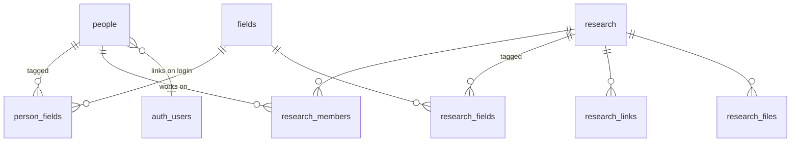

# ideaLab Website

The portfolio site for **HisarCS ideaLab** — makers, their profiles, and their
research. Read this top to bottom and you can run the site locally and deploy
it to production without having seen the code before.

- **What:** a Next.js 15 app (App Router) built as a **static export**, backed
  by Supabase (Postgres, Auth, Storage).
- **Why static + Supabase:** the frontend is free to host and has no server to
  maintain; every rule that matters lives in the database as Row Level
  Security, so a buggy or malicious frontend still can't leak or corrupt data.
- **Where:** GitHub Pages serves the pages; a Supabase cloud project is the
  backend. Locally, the whole Supabase stack runs in Docker.
- **How they connect:** [`lib/env.ts`](lib/env.ts) picks the local or
  production backend by hostname, at runtime.

```
Browser (GitHub Pages, static export)         Supabase (cloud or local Docker)
  /            homepage pixel mark  ──┐        ┌── Postgres + Row Level Security
  /members     member directory      ─┤        │   Auth — "Sign in with GitHub"
  /research    research directory    ─┤ supa- ─┤   Storage (avatars, resumes,
  /person?id=  public profile        ─┤ base   │            research-files)
  /research?id= research entry       ─┤  js    └── admin_github_logins allowlist
  /member      sign-in + dashboard   ─┘
```

---

## 1. Repo layout

| Path           | Role                                                                                                                                                                                                                                                                               |
| -------------- | ---------------------------------------------------------------------------------------------------------------------------------------------------------------------------------------------------------------------------------------------------------------------------------- |
| `app/`         | Routes: `/`, `/members`, `/research`, `/person?id=`, `/research?id=`, `/research/edit?id=`, `/member`. `/project?id=` is a deprecated redirect.                                                                                                                                    |
| `components/`  | React components + CSS Modules. Views: `PersonView`, `ResearchView` (curated write-ups), `ResearchEntryView` (member-created), `MembersIndex`, `ResearchIndex`, `PixelMark`, `MemberArea` + `member/`, `ResearchEditor` + `markdown/` (page renderer/editor), shared `SiteHeader`. |
| `lib/`         | Framework-agnostic layers: `env.ts`, `supabase.ts` (browser client), `data/` (all queries), `domain/` (types + pure logic), `util/`, `homepage/mark.ts`.                                                                                                                           |
| `public/`      | Static assets served as-is, including the preserved curated write-ups (`research/<slug>.html`) and their thumbnails.                                                                                                                                                               |
| `supabase/`    | Backend + local dev: `migrations/` (append-only — see below), `functions/` (Deno edge functions), `seed.sql` (local-only mock data, never pushed), `config.toml`.                                                                                                                  |
| `tests/unit/`  | vitest suite over the pure logic in `lib/`. Run with `npm test`.                                                                                                                                                                                                                   |
| `docs/`        | Architecture decisions (ADRs), local development + debugging guides, the research publishing framework.                                                                                                                                                                            |
| `package.json` | npm scripts (`dev`, `build`, `check`, `stack`, `logs:edge`, `db:push`) + dependencies.                                                                                                                                                                                             |

Mock data exists **only on localhost**; production never fakes content — an
empty lab renders the mark in ink only, and missing pages show an honest
"unavailable" card.

**Migrations are append-only** (ADR-0003): `20260711000001_schema.sql` is the
baseline; every later change is its own timestamped file. Editing an
already-applied migration is a no-op on production — `db push` skips files it
has recorded — so a "fix" there silently never ships. Never edit tables by hand
in Studio either, or local and production drift.

---

## 2. Data model

Full field-level detail (with comments) is in the baseline migration; this is
the map.


```mermaid
erDiagram
    people ||--o{ person_fields : tagged
    fields ||--o{ person_fields : ""
    people ||--o{ research_members : "works on"
    research ||--o{ research_members : ""
    research ||--o{ research_fields : tagged
    fields ||--o{ research_fields : ""
    research ||--o{ research_links : ""
    research ||--o{ research_files : ""
    people }o--|| auth_users : "links on login"
```

- **`people`** — one row per maker. Three identifiers with distinct jobs: `id`
  (uuid PK, what foreign keys point to), `public_id` (name-derived URL key,
  auto-generated on insert), `user_id` (nullable link to the GitHub login —
  null until first sign-in). Plus profile fields and `is_published`.
  - `graduation_year` is nullable because the row is created at first sign-in,
    but a `CHECK` forbids **publishing** without a year.
  - Student/alumni is **derived** from `graduation_year` (flips July 1,
    Istanbul) — never stored, so nobody updates flags every June.
  - `github_username` is **server-owned**: a trigger overwrites it with the
    login from the auth token, so it can't be spoofed
    (see [security model](#3-security-model)).
- **`research`** — member-owned entries. `created_by` records the maker; a
  trigger auto-adds them to `research_members`. Files and external links live
  in `research_files` / `research_links`. (Named `projects*` before the
  concepts merged — ADR-0018.)
  - `page` (jsonb, nullable) is the composed body as a Markdown document
    (`{version: 2, markdown}`); null falls back to `description`. Dialect +
    rationale: [the publishing framework](docs/research-publishing-framework.md),
    ADR-0019.
  - `external_authors` (jsonb) credits collaborators who have no account —
    display-only, no permissions.
  - The eight **curated** write-ups are _not_ in the database — they're static
    content (`lib/data/research.ts` + `public/research/`); `/research` lists
    both kinds together.
- **`fields`** — one canonical tag list shared by people and research
  (case-insensitive unique). Members add tags; only admins rename/delete.
- **Junction tables** (`person_fields`, `research_fields`, `research_members`)
  are the many-to-many links. `research_members` doubles as the permission
  list: being on it **is** the right to edit that entry.
- **`admin_github_logins`** — the admin allowlist.
- **`people_directory`** (view) — the one thing public pages read: published
  people + derived cohort + tag names, in a single query. At lab scale the site
  fetches it once and filters in JavaScript, so `people` is intentionally
  lightly indexed.

---

## 3. Security model

Every rule below is enforced by the **database** (RLS policies + triggers),
never the frontend.

| Actor            | Can                                                                                                                                                        |
| ---------------- | ---------------------------------------------------------------------------------------------------------------------------------------------------------- |
| **Anon**         | Read published people & research.                                                                                                                          |
| **Member**       | Edit **their own** profile (not the login link / GitHub username); manage tags; create/edit/delete research they're a member of; delete their own account. |
| **Admin**        | Everything, including publishing others and managing admins.                                                                                               |
| **Service role** | Bypasses RLS entirely — Studio, seed scripts, edge functions.                                                                                              |

- **Members publish themselves** (profiles and research) — drafts by default,
  publish/unpublish from their own UI. Guard triggers still protect `user_id`
  and the grad-year CHECK (ADR-0016).
- **Org membership is server-enforced** (ADR-0017): every write requires
  `is_org_member()`, which reads your GitHub login from the **auth token** and
  checks the `org_members` roster maintained by the
  [`verify-org-member` edge function](#d-org-gate-edge-function) — lazily, on
  each visit, no cron. Non-members get read-only access.
- **Admins are unspoofable**: `is_admin()` also reads the auth token, never a
  profile field, and checks `admin_github_logins`. `kmert10` is seeded; add
  more with one SQL insert (see [admin operations](#8-admin-operations)).
- When the last member leaves a research entry, a trigger deletes the orphaned
  entry.

---

## 4. Sign-in flow

Auth is a **GitHub App** ("Sign in with GitHub") — created in
[GitHub App setup](#b-github-app-for-sign-in).

1. "Continue with GitHub" → GitHub authorization → back to `/member`.
2. The app invokes `verify-org-member`, which asks GitHub (with the app's own
   installation token) whether the caller is in **HisarCS** and updates the
   `org_members` roster that RLS enforces. The browser's use of the verdict is
   only UX — the database is the boundary.
   - **Member** → onboarding.
   - **Not a member** → a "not one of us — email us" page, and the session is
     ended immediately.
3. First-timers fill onboarding (name, graduation year, interests) → their
   `people` row is inserted as a **draft**.
4. The dashboard's **Publish my profile** puts their pixel on the homepage;
   unpublish any time.

Account deletion is one call, `delete_my_account()`, behind a typed-handle
confirmation: it erases the person, tags, memberships (solo research cascades
away), uploaded files, and the login link.

---

## 5. Storage

Three public-read buckets; writes are scoped by folder ownership (RLS on
`storage.objects`):

- `avatars/{user_id}/…` — 512px master + 128px thumb for the homepage grid.
  No upload → initials tile tinted by `avatar_color`.
- `resumes/{user_id}/…` — `resume.pdf`, new upload replaces old. An external
  link works too.
- `research-files/{research_id}/…` — writable by that entry's member list;
  metadata (caption/kind/order) in `research_files`.

Upload rules live once in `UPLOAD_SPECS` ([`lib/util/media.ts`](lib/util/media.ts)):

| File           | Types           | Max   | Stored as                               |
| -------------- | --------------- | ----- | --------------------------------------- |
| Avatar         | JPEG, PNG, WebP | 10 MB | square-cropped 512px JPEG + 128px thumb |
| Resume         | PDF             | 5 MB  | as-is                                   |
| Research image | JPEG, PNG, WebP | 15 MB | optimized 1600px JPEG                   |
| Research PDF   | PDF             | 10 MB | as-is                                   |

Images are optimized **client-side** before upload (stepped downscale, JPEG
q0.85 — visually lossless at display sizes, 10–20× smaller than a phone photo).
The homepage grid loads the 128px thumbs lazily; uploads use version-busted
paths with 1-year cache headers. Videos are never stored here — host them
externally and link them.

---

## 6. Run it locally

Quickstart below; the full guide (including auth with a dev GitHub App) is
[docs/local-development.md](docs/local-development.md), and
[docs/local-debugging.md](docs/local-debugging.md) when something misbehaves.

```bash
# One-time (macOS shown)
brew install git node
brew install --cask docker && open -a Docker      # wait for "running"
npm install

# A localhost-only docker network so the local DB is never exposed to your LAN
docker network create -o 'com.docker.network.bridge.host_binding_ipv4=127.0.0.1' local-network
```

**Frontend only** (mock data, no database):

```bash
npm run dev        # http://localhost:3000
```

**Full stack** (real DB, auth, storage):

```bash
npm run stack      # Supabase on the localhost-only network + migrations + seed
npm run dev        # second terminal
```

Studio (DB admin UI): http://127.0.0.1:54323.

| Command               | Does                                                         |
| --------------------- | ------------------------------------------------------------ |
| `npm run dev`         | Next dev server at :3000.                                    |
| `npm run build`       | Static export to `out/` (set `NEXT_PUBLIC_BASE_PATH` first). |
| `npm run stack`       | Start the local Supabase stack.                              |
| `npm run stack:down`  | Stop it, discarding data.                                    |
| `npm run stack:reset` | Clean DB rebuilt from migrations + seed.                     |
| `npm run check`       | Format check + lint + typecheck + unit tests.                |
| `npm test`            | vitest unit suite.                                           |
| `npm run logs:edge`   | Tail local edge-function logs.                               |
| `npm run db:psql`     | psql shell on the local database.                            |

> ⚠️ Don't run `supabase db reset` directly — on the custom network it
> recreates the DB container where the other containers can't reach it. Use
> `npm run stack:reset`.

---

## 7. Deploy to production

### A. Supabase project (one-time)

1. Create a project at supabase.com; save the DB password.
2. `npx supabase link --project-ref <ref>`, then `npm run db:push`.
   `seed.sql` is local-only and never pushed.
3. Put the project's URL + anon key in the `production` block of
   [`lib/env.ts`](lib/env.ts) (the anon key is public-safe — RLS is the
   boundary).

### B. GitHub App for sign-in

The site needs its **own** GitHub App (the Supabase↔GitHub integration app in
the org cannot be reused for user login). Owned by the org so it survives
graduations:

1. HisarCS org → _Settings → Developer settings → GitHub Apps → New_:
   - **Callback URL:** `https://<project-ref>.supabase.co/auth/v1/callback`
   - Check **"Request user authorization (OAuth) during installation"**;
     uncheck the webhook.
   - **Permissions:** Account → _Email addresses: read_ · Organization →
     _Members: read_ (for the membership check).
   - Installable **only on this account**.
   - Generate a **client secret**; copy the **Client ID**.
2. **Install the app on the HisarCS org** (app page → _Install App_ → All
   members). Without installation, the membership check returns
   `403 Resource not accessible by integration` and sign-in dead-ends.
3. Supabase → _Authentication → Providers → GitHub_ → enable, paste Client
   ID + secret.
4. Supabase → _Authentication → URL Configuration_ → **Site URL** = the Pages
   URL; add the site as a **Redirect URL**
   (`https://hisarcs.github.io/HisarCS-mastersite/**`) plus
   `http://localhost:3000` for local dev.

### C. GitHub Pages

1. Repo → _Settings → Pages_ → **Source: GitHub Actions**.
2. Every push to `main` runs
   [`deploy.yml`](.github/workflows/deploy.yml): `npm run build` → publish
   `out/`. Site: `https://hisarcs.github.io/HisarCS-mastersite/`.
3. The base path is the single `NEXT_PUBLIC_BASE_PATH` env var in that
   workflow — clear it for a future root-domain move.

> **Schema changes ship with the frontend.** The site queries the database
> directly, so a migration that renames or drops anything the deployed code
> reads breaks the live site. Run `npx supabase db push` and merge to `main`
> in the same window (brief downtime is acceptable here). ADR-0018 is the
> worked example.

### D. Org-gate edge function

The server-side membership gate (ADR-0017) lives in
`supabase/functions/verify-org-member`. Deploy or rotate:

```bash
# Secrets: the GitHub App's own credentials — the private key never reaches
# the browser. VERIFY_TTL_SECONDS optional (default 900s).
supabase secrets set GH_APP_ID=… GH_APP_INSTALLATION_ID=… \
  GH_APP_PRIVATE_KEY="$(cat your-app.private-key.pem)"

supabase functions deploy verify-org-member
```

The browser invokes it at signup and as a throttled background refresh; it
upserts/removes the caller's `org_members` row, which every RLS write policy
checks via `is_org_member()`.

### E. First admin & smoke test

`kmert10` is seeded as admin. Verify in production:

- [ ] Homepage loads published people; a pixel opens the right profile.
- [ ] A **member**: sign in → onboarding → draft → **Publish my profile** → pixel appears.
- [ ] Avatar + resume upload land in Storage under the user's id.
- [ ] A **non-member**: "not one of us" page, session ended, no dashboard.
- [ ] A research entry: create from the dashboard, write the Markdown page,
      publish, and open it publicly.

---

## 8. Admin operations

Use Studio (local: http://127.0.0.1:54323 · production: supabase.com dashboard).
**Studio runs as the service role — it bypasses RLS and guard triggers**;
data-generating triggers (public_ids, github sync) still fire.

```sql
-- publish a member (requires graduation_year)
update people set is_published = true where public_id = 'mert-karakas';

-- add / remove an admin
insert into admin_github_logins (github_login) values ('their-username');
delete from admin_github_logins where github_login = 'their-username';

-- rename a tag everywhere / delete one
update fields set name = 'CS & AI' where name = 'CS and AI';
delete from fields where name = 'Typo Tag';

-- publish a research entry
update research set is_published = true where public_id = 'pixel-wall';

-- see exactly what the public site sees
select * from people_directory;
```

Golden rules: local mistakes are free (`npm run stack:reset`); production has
no reset — prefer the site's own flows and hand-edit surgically; **schema
changes always go through a new migration file**, never Studio.

---

## 9. Roadmap

1. **Search / sort / filter** on the `/members` and `/research` directories
   (the `people_directory` view already backs this).
2. A small **admin panel** (publish queue, allowlist management, edit anyone).
3. Fill in **authors** for the curated write-ups in `lib/data/research.ts`.
4. Schema-anticipated extensions: cohort override for mentors/staff, awards,
   full-text bio search.
